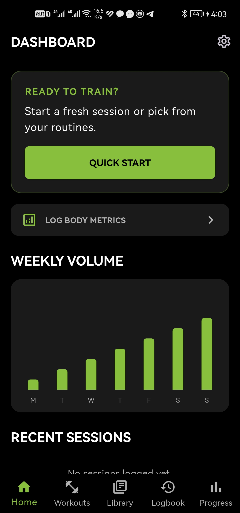
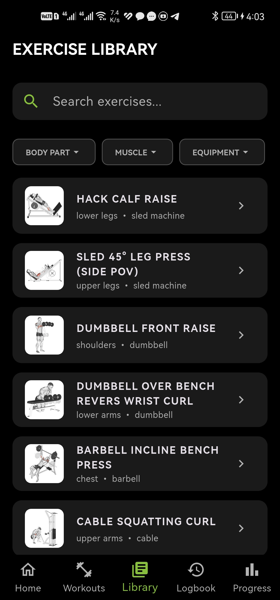
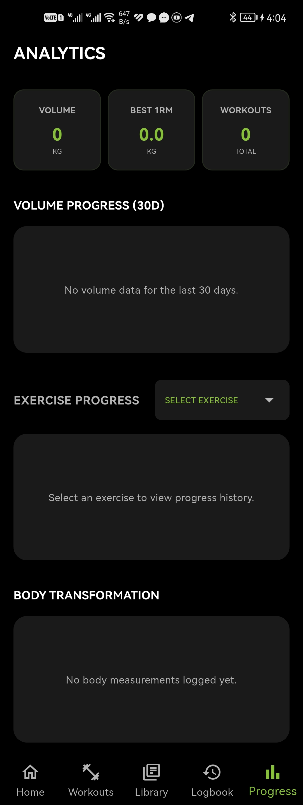
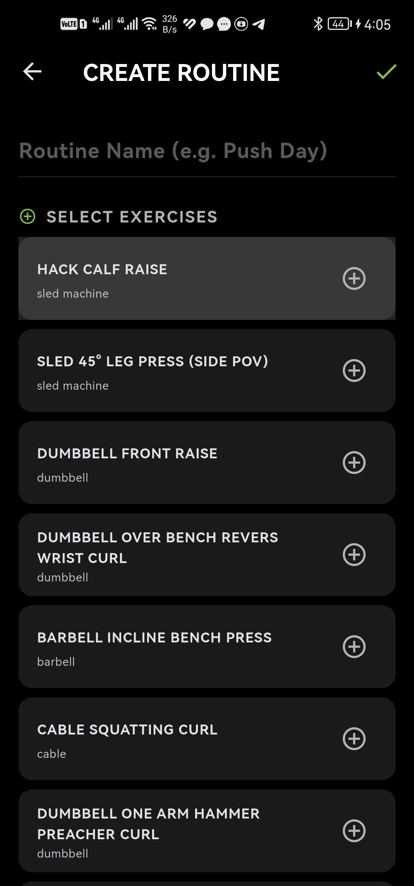
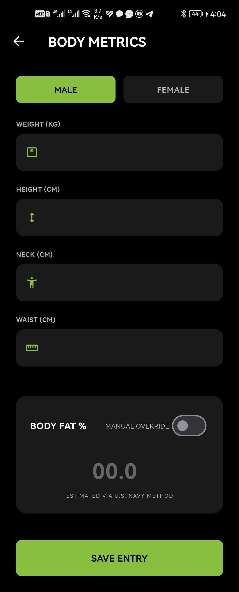
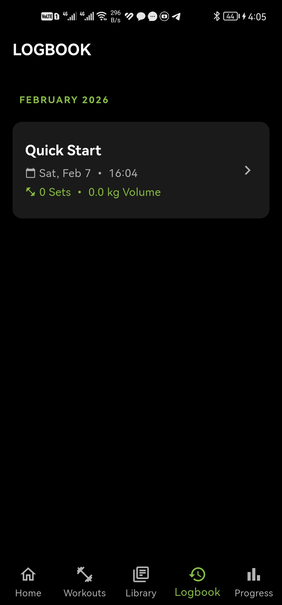

<div align="center">

# 💪 Fitness Tracker

## *Level up your strength with precision analytics*

[](https://flutter.dev/)
[](https://www.sqlite.org/)
[](https://pub.dev/packages/provider)
[](LICENSE)

---

*A premium fitness tracking experience with cutting-edge analytics and a stunning neon-dark aesthetic.*

</div>

---

## 🚀 Key Features

| Feature | Description |
|---------|-------------|
| 🔥 **High-Intensity Routine Builder** | Create custom workout routines with advanced exercise selection and timing |
| ⏱️ **Smart Active Logger** | Intelligent workout logging with built-in rest timers and auto-tracking |
| 📊 **Advanced Analytics** | Track volume trends, 1RM progression, and performance metrics over time |
| 🧮 **Body Fat Calculator** | U.S. Navy Method calculator with manual override options |
| 🌙 **Premium Dark Theme** | Stunning Orbitron/neon aesthetic with high-contrast design |
| 📱 **Cross-Platform** | Built with Flutter for seamless iOS, Android, and desktop experience |

---

## 🛠 Tech Stack

| Technology | Version | Purpose |
|------------|---------|---------|
| **Flutter** | ^3.10.4 | UI Framework & Cross-platform development |
| **Provider** | ^6.1.1 | State management architecture |
| **SQLite** | ^2.3.0 | Local database and data persistence |
| **fl_chart** | ^0.63.0 | Advanced charting and data visualization |
| **Google Fonts** | ^5.1.0 | Typography and custom fonts |
| **Path Provider** | ^2.1.1 | File system access and storage |
| **Local Notifications** | ^17.1.2 | Push notifications and reminders |
| **Share Plus** | ^10.1.3 | Data export and sharing capabilities |

---

## 📸 Screenshots Gallery

<div align="center">

| Dashboard | Workout Library | Progress Analytics |
|-----------|----------------|-------------------|
| [](assets/images/screens/Dashboard.jpg) | [](assets/images/screens/Library.jpg) | [](assets/images/screens/Analytics.jpg) |

| Routine Builder | Body Metrics | Workout History |
|----------------|--------------|----------------|
| [](assets/images/screens/Routines.jpg) | [](assets/images/screens/Metrics.jpg) | [](assets/images/screens/History.jpg) |

*📸 Live app screenshots showcasing the premium fitness tracking experience*

</div>

---

## 📦 Installation Guide

### Prerequisites

- Flutter SDK (>= 3.10.4)
- Dart SDK (>= 3.0.0)
- Android Studio / Xcode (for mobile development)

### Quick Start

```bash
# Clone the repository
git clone https://github.com/Ziad-Abaza/fitness-tracker.git
cd fitness-tracker

# Install dependencies
flutter pub get

# Run the app
flutter run

# For specific platforms
flutter run -d android      # Android
flutter run -d ios          # iOS
flutter run -d chrome       # Web
flutter run -d windows      # Windows
flutter run -d macos        # macOS
flutter run -d linux        # Linux
```

### Build for Production

```bash
# Android APK
flutter build apk --release

# Android App Bundle
flutter build appbundle --release

# iOS
flutter build ios --release

# Web
flutter build web --release

# Desktop builds
flutter build windows --release
flutter build macos --release
flutter build linux --release
```

---

## 🏗 Architecture

### Clean Provider-Based State Management

```
lib/
├── core/           # App theme, constants, utilities
├── models/         # Data models and entities
├── providers/      # State management with Provider
├── services/       # Business logic and API services
├── ui/            # User interface components
│   ├── screens/   # Main app screens
│   ├── widgets/   # Reusable UI components
│   └── themes/    # Custom themes and styles
└── utils/         # Helper functions and utilities
```

### Data Layer Architecture

- **SQLite Database**: Local storage for workouts, exercises, and metrics
- **Provider Pattern**: Reactive state management with dependency injection
- **Repository Pattern**: Clean separation between data sources and business logic
- **Service Layer**: Encapsulated business logic for features like notifications and analytics

> 💡 **Design Philosophy**: The app follows a clean architecture pattern with clear separation of concerns, making it highly maintainable and testable.

---

## 🎯 Core Features Deep Dive

### 🏋️ Exercise Library
- **500+ Exercises**: Comprehensive database with detailed exercise information
- **Muscle Group Targeting**: Filter exercises by specific muscle groups
- **Equipment Filtering**: Find exercises based on available equipment
- **Exercise GIFs**: Visual demonstrations for proper form

### 📈 Advanced Analytics
- **Volume Tracking**: Monitor total workout volume over time
- **1RM Calculator**: Estimate one-rep maximum based on performance
- **Progress Trends**: Visual charts showing strength and endurance improvements
- **Body Composition**: Track weight, body fat percentage, and measurements

### ⚡ Smart Workout Features
- **Auto-Rest Timers**: Intelligent rest period management between sets
- **Workout Templates**: Save and reuse favorite workout routines
- **Performance History**: Detailed logs of every workout session
- **Export Functionality**: Share workout data via CSV or other formats

---

## 🤝 Contributing

We welcome contributions! Please follow these steps:

1. **Fork** the repository
2. **Create** a feature branch (`git checkout -b feature/amazing-feature`)
3. **Commit** your changes (`git commit -m 'Add amazing feature'`)
4. **Push** to the branch (`git push origin feature/amazing-feature`)
5. **Open** a Pull Request

### Development Guidelines

- Follow Flutter/Dart best practices
- Write clean, commented code
- Test your changes thoroughly
- Update documentation as needed

---

## 📞 Contact & Support

| Platform | Link |
|----------|------|
| 📧 **Email** | [zeyad.h.abaza@gmail.com](mailto:zeyad.h.abaza@gmail.com) |
| 🐛 **Bug Reports** | [GitHub Issues](https://github.com/Ziad-Abaza/fitness-tracker/issues) |
| 💬 **Discussions** | [GitHub Discussions](https://github.com/Ziad-Abaza/fitness-tracker/discussions) |
| 🌐 **Website** | [ZiadAbaza.com](https://ziad-abaza.github.io/Portfolio) |

---

<div align="center">

## ⭐ Show Your Support
Made with ❤️ and 💪 by the Fitness Tracker Team
---

*"The only bad workout is the one that didn't happen."*

</div>
